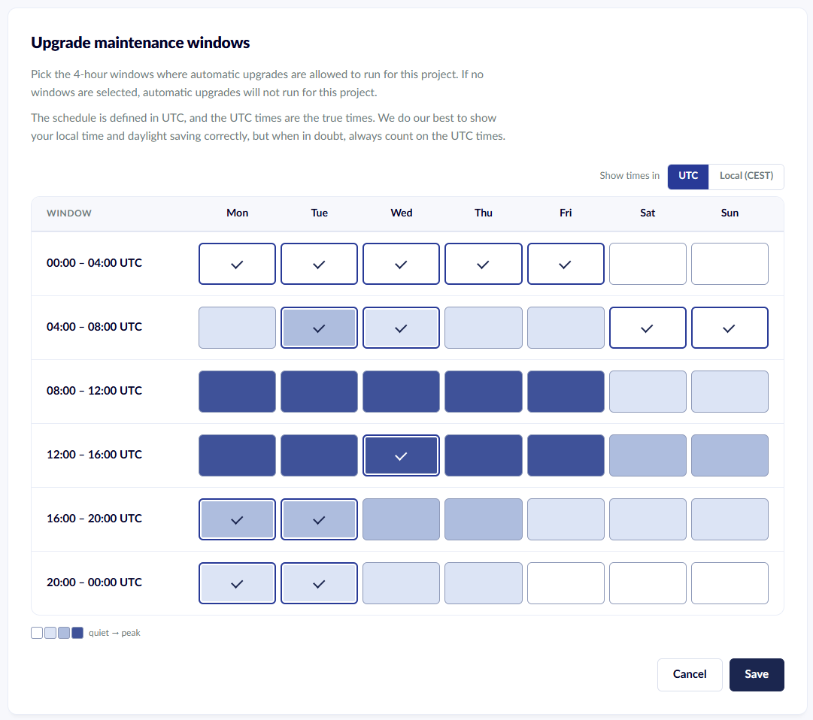
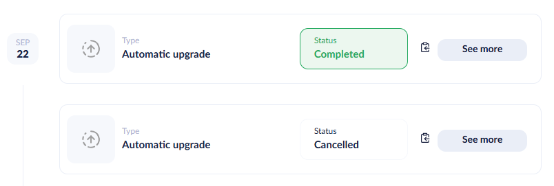
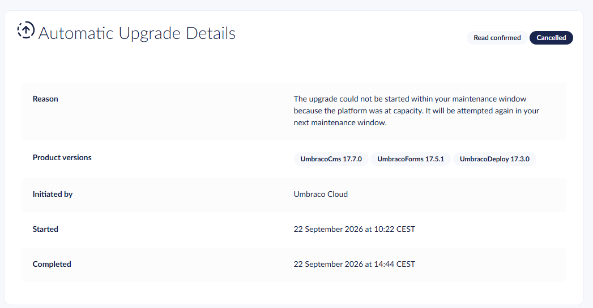

# Minor and Patch Upgrades

Both minor and patch upgrades can be managed from the **Configuration** -> **Automatic Upgrades** page in the Cloud Portal. The same page controls the maintenance windows where automatic upgrades are allowed to start.

* [Automatic Minor Upgrades](minor-upgrades.md#automatic-minor-upgrades)
* [Automatic Patch Upgrades](minor-upgrades.md#automatic-patch-upgrades)
* [Maintenance Windows](minor-upgrades.md#maintenance-windows)
* [Upgrade from the Cloud Portal](minor-upgrades.md#upgrade-from-the-cloud-portal)
* [Manual Upgrades](minor-upgrades.md#manual-upgrades)

## Automatic Minor Upgrades

To enable automatic minor upgrades, follow these steps:

1. Go to your Umbraco Cloud project.
2.  Navigate to **Configuration** -> **Automatic Upgrades**.

    <figure><figcaption>
Settings Umbraco Cloud
</figcaption></figure>
3.  Enable **Automatic Minor Upgrades**.

    <figure><figcaption>
Enable Minor Upgrades
</figcaption></figure>

With automatic upgrades enabled, all products on Umbraco Cloud will automatically be upgraded. This includes Umbraco CMS, Umbraco Forms, and Umbraco Deploy. Your project does not need to be running the latest minor version for automatic upgrades to work. The project is upgraded to the latest minor version in one of its [maintenance windows](#maintenance-windows) after the release is available.

If you create a new project on Umbraco Cloud automatic upgrades are enabled by default.


Use a secondary mainline environment to test upgrades before sending them to Live. While automatic upgrades and upgrades started from the Cloud Portal do not require a second environment, omitting one means upgrades apply directly to Live.


A secondary mainline environment is included in all Umbraco Cloud plans, except Starter. Find pricing details for Umbraco Cloud Starter plans on our [website](https://umbraco.com/products/umbraco-cloud/pricing).

## Automatic Patch Upgrades

By default, all Umbraco Cloud projects are automatically upgraded to new patch versions during their [maintenance windows](#maintenance-windows). This includes security patches and ensures all sites run the most stable and secure versions.

You can toggle **Automatic Patch Upgrades** on or off from the same **Configuration** -> **Automatic Upgrades** page.


When you disable automated patch upgrades, you are responsible for keeping your project up to date. Falling behind on patches may affect your eligibility for support. It can also expose your project to known security vulnerabilities.



Umbraco reserves the right to patch critical vulnerabilities, also outside of your maintenance windows and when automatic upgrades are disabled. This ensures the Umbraco Cloud platform remains stable and secure.


## Maintenance Windows

Automatic minor and patch upgrades follow a weekly schedule made up of maintenance windows. An automatic upgrade only starts inside one of the maintenance windows selected for your project.

* The week is split into 42 windows of 4 hours each.
* Each day has six windows, starting at 00:00, 04:00, 08:00, 12:00, 16:00, and 20:00 UTC.
* You can select as many windows as you need.
* The default schedule is Tuesday from 08:00 to 20:00 UTC. The default covers the Tuesday windows starting at 08:00, 12:00, and 16:00 UTC.
* If no windows are selected, automatic upgrades do not run for the project.


Maintenance windows are defined in UTC and do not move with daylight saving time. For example, the 08:00 UTC window starts at 10:00 Central European Summer Time (CEST) and at 09:00 Central European Time (CET).


### What Happens in a Maintenance Window

At the start of each window, Umbraco Cloud checks the projects that have the window in their schedule. A project is queued for an upgrade when a release is available that the project can take.

The upgrade runs through the mainline environments from left to right, for example Development, Staging, and then Live. Environments that already run the release, or a later version, are skipped. The upgrade is shown as an **Automatic upgrade** on the [Project History](../../monitor-and-troubleshoot/project-history.md) page.

A maintenance window controls when an upgrade starts, not when it finishes. Once the upgrade has started on the first environment, it continues through the remaining environments. The upgrade can finish after the window has closed, especially on projects with several environments.

Selecting several windows does not lead to several upgrades. Each release is applied once, and extra windows give Umbraco Cloud more opportunities to start the upgrade.

### Change the Maintenance Windows

1. Go to your Umbraco Cloud project.
2. Navigate to **Configuration** -> **Automatic Upgrades**.
3. Select the windows where automatic upgrades are allowed to start under **Upgrade maintenance windows**.
   * Use **Show times in** to switch between UTC and your local time. The UTC times are the times the schedule uses.
4. Select **Save**.

<figure><figcaption>
Selecting maintenance windows for automatic upgrades
</figcaption></figure>

The picker shades each window by how busy the platform currently is, from quiet to peak. Selecting quieter windows lowers the risk of an upgrade being postponed.

### When an Upgrade Is Postponed

Many projects share the same maintenance windows. Umbraco Cloud cannot always start every queued upgrade before a window closes. An upgrade that cannot start in time is cancelled with the following reason:

> The upgrade could not be started within your maintenance window because the platform was at capacity. It will be attempted again in your next maintenance window.

The cancelled upgrade is shown on the [Project History](../../monitor-and-troubleshoot/project-history.md) page as an **Automatic upgrade** with the status **Cancelled**.

<figure><figcaption>
A cancelled and a completed automatic upgrade on the Project History page
</figcaption></figure>

Select **See more** to view the reason and the product versions of the cancelled upgrade.

<figure><figcaption>
Details of an automatic upgrade cancelled because the platform was at capacity
</figcaption></figure>

A release is considered for automatic upgrades for 7 days after it is made available. Within those 7 days, a cancelled upgrade is attempted again in the next window in your schedule.

If your schedule contains a single window, the release gets a single attempt. After a cancelled upgrade, your project is upgraded automatically with the next release. To upgrade before then, start the upgrade from the Cloud Portal. See the [Upgrade from the Cloud Portal](#upgrade-from-the-cloud-portal) section.

Selecting more than one window gives each release more attempts and lowers the risk of a missed upgrade.

### When a Project Is Not Upgraded

A project is upgraded in its maintenance window when all of the following conditions are met:

* The matching setting is enabled. Patch releases require **Automatic Patch Upgrades**, and minor releases require **Automatic Minor Upgrades**.
* The release was made available within the last 7 days.
* No other upgrade is running on the project. Otherwise, the project is checked again in its next window.
* The release has not been attempted on the project before. After a failed automatic upgrade, the next automatic attempt comes with a newer release.
* No environment has been upgraded to the release, or a later version, outside of the automatic upgrade. In that case, the release is skipped and the project waits for a newer release.

To retry a failed automatic upgrade without waiting for a newer release, start the upgrade from the Cloud Portal. See the [Upgrade from the Cloud Portal](#upgrade-from-the-cloud-portal) section.

Umbraco Heartcore projects do not use maintenance windows.

## Upgrade from the Cloud Portal

When a newer version of a product is available for your project, an **Upgrade available** banner is shown in the Cloud Portal. The banner appears on the left-most mainline environment card. Project administrators select **Get started** on the banner to review and start the upgrade.

<figure><figcaption>
The Upgrade available banner on an environment card
</figcaption></figure>

The banner offers any higher minor or patch version within the major version your project runs. Major version upgrades are never offered by the banner. See the [Major Upgrades](major-upgrades/README.md) article for how to upgrade to a new major version.

The following products are upgraded through the banner:

* Umbraco CMS
* Umbraco Forms
* Umbraco Deploy
* Umbraco Deploy Contrib
* Umbraco Cloud CMS
* Umbraco ID
* Azure Blob Storage provider

All eligible products are upgraded in a single run. The banner names one or two products, or shows a package count when more are available. The confirmation dialog lists every package with its current and target version.

<figure><figcaption>
The confirmation dialog listing the packages to upgrade
</figcaption></figure>

The upgrade is applied to the left-most mainline environment only. Test the upgrade there, and then deploy the changes to the next environments yourself. Pending changes between environments do not block the upgrade. The upgrade commit is added on top of the pending changes and is included in the next deployment.


Projects with a single Live environment can also upgrade from the banner. As there is no other environment to test on, the upgrade is applied directly to Live. The site restarts during the upgrade. The confirmation dialog warns about the restart and links to the version-specific upgrade notes.


The banner is independent of the **Automatic Minor Upgrades** and **Automatic Patch Upgrades** settings and of your maintenance windows. Selecting **Get started** is an explicit action. The upgrade runs even when automatic upgrades are disabled or no maintenance window is open.

### When a version is not offered

A newer version can exist on NuGet without being offered by the banner. The banner only offers versions that meet the following conditions:

* The project runs on a supported Umbraco version.
* The release has been marked ready on Umbraco Cloud.
* The release was created within the last year.

The banner is hidden while an upgrade is in progress, and for up to three hours after an upgrade stops reporting progress. Umbraco Heartcore projects and baseline child projects do not see the banner.

## Manual Upgrades

A manual upgrade involves a more hands-on approach, where the upgrade process is initiated and controlled by the user or development team. This allows for greater flexibility and oversight, enabling teams to test and adapt the upgrade to their specific needs and configurations. A manual upgrade provides an opportunity to thoroughly test the new version in a controlled environment before applying it to live production environments. This ensures compatibility and minimizes disruptions.

For more information about manual upgrades, see the [Manual upgrade of Umbraco CMS](manual-upgrades/manual-cms-upgrade.md) article.

## Troubleshooting Automated Minor Upgrades

Umbraco Cloud supports performing minor upgrades to your projects automatically. The feature is available when a new minor version of Umbraco is released (for example 10.5.0 or 10.6.0).

The upgrade will resolve most issues it encounters, but some Umbraco configurations may need manual intervention. This is usually related to custom code that depends on APIs that have changed or been removed in the new minor version.

If anything fails during this process, you can reach out for support using the in-app chat in the bottom right corner. We will assist you through the upgrade process if any issues arise.

## Database Upgrade Failing

Symptoms and feedback are given from the upgrade process: **Unable to run the Umbraco installer**

The first step in the process, after having updated all the files, is to call the Umbraco install engine. This is done in order to get its database updated to support the new version. As this step is the first time the site gets requested after the updated files are run, it may fail. The reason is often code that is incompatible with the upgraded files.

It can be code that references APIs that have been deprecated, or code that has some strong references to specific versions. If the error is clear, it will be shown on the screen. It will be a typical ASP.NET error message also called a Yellow Screen of Death (YSOD). You should request the site, and check the error it shows. If the error isn't descriptive, then it is time to clone the repository to your local machine and fix the issue. The usual suspects would be:

* The code you have running is referencing an API that has been changed, is being modified, is obsolete, or removed.
* The `web.config` had assembly bindings for a specific DLL version that doesn't exist anymore. During the upgrade process, we do update the references we are shipping, but there might be something missing.

Once you have the site running locally, you should push your changes to the repository. This will update the site, and it should now be in a running state.

The upgrade process left off when it needed three more steps. These three steps now need to be done manually.

1. Complete the installer
   * To complete the installer, you should visit the site: `https://dev-YOURSITEALIAS.euwest01.umbraco.io`. This will show you the installer screen, where you should insert your backoffice credentials and follow the process. It will run through a few steps, and later Umbraco will be updated to the latest version.
2. Export the metadata files.
   * The second thing you need to do is to regenerate the metadata files used for transferring items like document types, data types, and media types. This is done by accessing the Power tools (Kudu) on the project, opening the cmd prompt, and browsing to the wwwroot/data folder. Once there, you need to enter `echo > deploy-export`. This will generate the required files for the upgraded site to work with Umbraco Deploy.
3. The last thing to do is to go to the `/site/locks` folder (still through Kudu) and rename the file called `upgrading` to `upgraded-minor` - rename the file by typing `ren upgrading upgraded-minor`. This will indicate to Umbraco Cloud, that the left-most environment is now ready to deploy all its changes to the next environment.

Before deploying the upgrade to the next environment, you should verify that everything looks as expected on the left-most environment.
